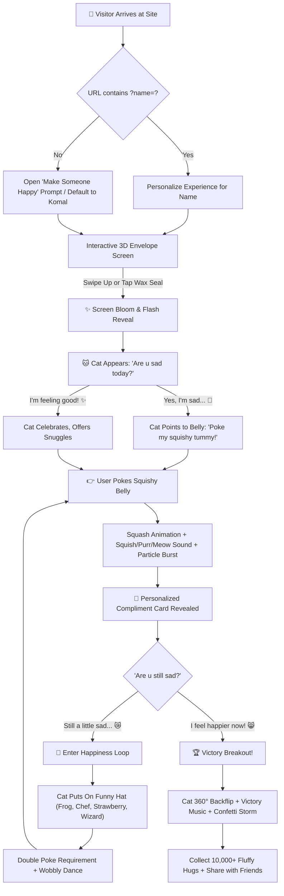

# 🐾Happiness Loop (Smile Maker) 🌸
### *An Interactive Heartwarming Pastel Cat Experience to Absorb Sadness & Spread Smiles*

[](https://smilemaler.netlify.app/)
[](https://smilemaler.netlify.app/)
[](https://smilemaler.netlify.app/)
[](https://smilemaler.netlify.app/)
[-FFD166?style=for-the-badge&logo=w3c&logoColor=black)](https://smilemaler.netlify.app/)

---

## 🌟 Live Demo

Experience the full interactive app directly in your browser:  
👉 **[https://smilemaler.netlify.app/](https://smilemaler.netlify.app/)**

> 💌 **Tip**: You can also personalize the experience for anyone by appending their name to the URL:  
> `https://smilemaler.netlify.app/?name=Sarah` or `https://smilemaler.netlify.app/?name=Alex`

---

## 📖 Overview

**Komal's Happiness Loop (Smile Maker)** is an interactive, uplifting web application created to cheer up anyone having a tough day. Centered around an adorable squishy marshmallow pastel kitten, the experience guides visitors through a playful loop: absorbing sadness with interactive belly pokes, swapping into silly collectible hats, delivering customized sweet notes, and rewarding them with unlimited fluffy hugs upon breaking the loop!

Built entirely with **pure HTML5, CSS3, and modern Vanilla JavaScript**, the project requires zero external runtime dependencies and features a 100% code-synthesized sound engine via the native browser Web Audio API.

---

## ✨ Key Features

### 💌 1. 3D Interactive Opening Letter & Wax Seal
- **Realistic Cartoon Envelope**: Designed with layered SVG/CSS paper elements, wax seal with a heart emblem, and a peek-through customized letter card.
- **Swipe-to-Open Gesture**: Natural mobile touch swipe-up or mouse drag interaction with spring resistance, alongside one-tap seal opening.
- **Magical Screen Bloom**: Envelope opening triggers a multi-colored heart/sparkle burst, a full-screen bright flash bloom, and a slow fade transition into the kitten's stage.

### 🐱 2. Interactive SVG Marshmallow Cat (`cat.js`)
- **Handcrafted Vector Artwork**: Scalable, high-resolution SVG character featuring marshmallow body gradients, blushing cheeks, wagging tail, and responsive paws.
- **Squash-and-Stretch Physics**: Tapping or clicking the cat's squishy tummy triggers real-time marshmallow compression animations and joyful wobble physics.
- **Dynamic Emotional Expressions**:
  - 🥺 **Worried**: Big glossy eyes with glistening tears and worried brows (intro state).
  - 😸 **Squish / Purr**: Sweet curved closed eyes (`^ _ ^`) and a purring W-shaped mouth.
  - ✨ **Happy**: Sparkling star highlights in the eyes with an open happy smile and tongue.
  - 😎 **Party Star**: Golden star sunglasses and a cheerful grin for victory celebrations.
- **Dynamic Paw States**: Resting idle paws, pointing paw directing the user to the tummy, and dual paws raised high in victory.
- **Interactive Tummy Pulse**: A floating animated "Poke Belly! 👇" badge guiding user actions.

### 👒 3. Collectible Hats & Continuous Happiness Loop
When a user expresses that they are *"Still a little sad..."*, the application enters the **Happiness Loop**:
- Rounds advance sequentially (`Round 1`, `Round 2`, `Round 3`...) with a glowing badge indicator.
- The cat puts on funny hats to cheer the user up:
  - 🐸 **Frog Beanie Hat**: Pastel green beanie with glossy frog eyes and blush.
  - 🧑‍🍳 **Master Chef Hat**: White pleated chef toque complete with a wooden spoon tucked in.
  - 🍓 **Strawberry Beret**: Vibrant red beret with a leafy green stem and golden seeds.
  - 🧙 **Magical Wizard Hat**: Royal purple pointed hat with yellow glowing stars.
  - 🎉 **Party Cone Hat**: Striped festive cone hat with a golden pompom for the grand finale.
- **Progressive Mechanics**: Successive loop rounds require a "Double Poke" to absorb deeper sadness.
- **Wobbly Cat Dance**: The cat does an energetic wiggle dance when donning each new hat.

### 🎁 4. Personalized Magic Link Generator (`?name=...`)
- **Custom Recipient Support**: Visitors can create personalized greeting links for friends, family, or partners by clicking **"Make Someone Happy"** or **"Send Happiness To A Friend"**.
- **Instant Full-DOM Rebranding**: Updating the recipient name automatically customizes:
  - Document `<title>` and Open Graph `<meta>` tags
  - Opening letter greeting card (*"Dear [Name] 💖"*)
  - Interactive speech bubbles (*"Aww, [Name]... Are u sad today? 🥺"*)
  - Sweet compliment cards tailored with the recipient's name
  - Header brand badge
  - Victory celebration screen (*"Yay! [Name] is happy again! 🎉"*)
- **1-Click WhatsApp Sharing**: Generates a pre-formatted WhatsApp invitation message with the personalized URL.
- **Clipboard Copying**: Instant copy to clipboard with floating heart bursts and visual feedback.
- **URL Parameter & Hash Support**: Automatically reads `?name=Recipient` (with fallback to `#name=Recipient`), sanitized against script injection.

### 🔊 5. 100% Synthesized Web Audio Engine (`audio.js`)
Zero external MP3, WAV, or OGG files are required! The audio engine uses the browser's native Web Audio API to synthesize every sound in real time:
- **Adorable Kitten Meow**: Frequency-modulated triangle oscillator swept through a resonant bandpass filter (320Hz ➔ 620Hz ➔ 540Hz ➔ 380Hz).
- **Soothing Kitten Purr**: Lowpass-filtered (140Hz) warm rumble noise modulated by a 25Hz purring vibration cycle.
- **Marshmallow Squish Pop**: Rapid exponential sine pitch slide (220Hz ➔ 580Hz ➔ 280Hz).
- **Magical Compliment Chime**: Crystal arpeggio across four musical pitches (`C5`, `E5`, `G5`, `C6`).
- **Giggle / Chirp Effect**: Multi-pitch frequency bursts simulating a happy kitten giggle.
- **Upbeat Chiptune Victory Tune**: Full multi-note celebratory music box melody playing when the sadness loop is broken.
- **Paper Envelope Swoosh**: Envelope opening sound combining white-noise rustle with a delicate high-frequency chime sweep.
- **Global Mute / Sound Toggle**: Floating header button allowing users to mute or unmute audio at any time.

### 🎆 6. High-Performance Canvas Particle Engine
- A dedicated `<canvas id="particlesCanvas">` running at 60 FPS via `requestAnimationFrame`.
- Supports 4 particle styles:
  - 🐾 **Paw Prints**: Floating cat paw stamps.
  - 💖 **Kawaii Hearts**: Assorted hearts, blossoms, and sparkles (`💖`, `🌸`, `💕`, `✨`, `😻`).
  - ✨ **Sparkles**: Shimmering fairy dust particles.
  - 🎊 **Confetti Ribbons**: Multi-colored celebratory streamers with 3D rotational physics.
- Realistic particle physics: velocity, gravity, rotational inertia, air drag, and linear opacity decay.

### 🏆 7. Victory Modal & Interactive Hugs Dispenser
- Triggered when the user clicks *"I feel happier now! 😸"*.
- **Cat Backflip**: The SVG cat executes an energetic 360-degree backflip with paws held high.
- **Confetti Storm**: Continuous celebratory confetti ribbons cascade down the screen.
- **Fluffy Hugs Counter**: Starts with **10,000 Fluffy Cat Hugs** awarded.
- **Hug Dispenser Button**: Tap *"💖 Tap for 1,000 More Hugs! 🐱"* to dispense an endless shower of hugs and heart particle bursts.
- **Reopen & Replay Options**: Restart the experience or replay the opening envelope anytime.

---

## 🎨 Design & Aesthetic System (`style.css`)

The user interface follows a modern, kawaii pastel aesthetic inspired by contemporary Japanese stationery and feel-good cozy games:

| Element | Specification |
| :--- | :--- |
| **Color Palette** | Soft Rose (`#FFF0F5`), Berry Purple (`#5A3D56`), Pastel Pink (`#FF8DA1`), Sunny Gold (`#FFD166`), Mint Green (`#48C78E`), Lavender (`#F0EEFB`) |
| **Background** | 4-color fluid animated mesh gradient shifting across a 14s infinite loop |
| **Ambient Atmosphere** | Blurred, gently drifting clouds floating across background layers |
| **Typography** | Google Fonts: [`Fredoka`](https://fonts.google.com/specimen/Fredoka) (round playful headings) & [`Nunito`](https://fonts.google.com/specimen/Nunito) (legible friendly body text) |
| **Surfaces & Glassmorphism** | Semi-translucent glass cards (`rgba(255, 255, 255, 0.88)`), subtle frosted border highlights, and soft layered drop shadows |
| **Responsive Design** | Mobile-first layout, full viewport support, gesture touch optimization, prevention of double-tap zoom |

---

## 📂 Project Structure

```
Happyapp/
│
├── index.html        # Main semantic HTML5 markup, envelope 3D structure, modals, HUD
├── style.css         # Complete design system, animations, glassmorphism, responsive layout
├── app.js            # Main application controller, state machine, particle engine, events
├── cat.js            # AnimatedCat class: SVG graphics, expressions, hats, squash physics
├── audio.js          # SoundController: Web Audio API synthesis engine (meow, purr, chimes)
└── README.md         # Full project documentation & architecture guide
```

### Detailed File Responsibilities

#### 1. [`index.html`](file:///d:/Happyapp/index.html)
- Houses the semantic layout: ambient background clouds, particles canvas, 3D envelope opening screen, brand navigation header, speech bubbles, cat stage mount, compliment card, action buttons, victory modal, and the name generator dialog.
- Configured with mobile viewport settings (`user-scalable=no`) and dynamic SVG favicon (`🐱`).

#### 2. [`style.css`](file:///d:/Happyapp/style.css)
- Contains over 1,500 lines of curated CSS with CSS custom properties (`--primary-berry`, `--accent-pink`, etc.).
- Defines keyframe animations: `gradientShift`, `floatCloud`, `squishBounce`, `wobblyDance`, `catBackflip`, `heartFloat`, `pulseGlow`, and envelope 3D flap folds (`rotateX`).

#### 3. [`cat.js`](file:///d:/Happyapp/cat.js)
- Encapsulates the `AnimatedCat` object.
- Builds and injects the complete SVG character markup into `#catMount`.
- Controls expression layers (`worried`, `squish`, `happy`, `party`), paw poses (`idle`, `pointing`, `raised`), and hat overlays (`frog`, `chef`, `strawberry`, `wizard`, `party`).
- Drives squash-and-stretch CSS physics transitions when `triggerSquish()` is called.

#### 4. [`audio.js`](file:///d:/Happyapp/audio.js)
- Encapsulates the `SoundController` object.
- Manages an `AudioContext` with user-gesture unlocking.
- Creates custom oscillators, gain envelopes, noise buffers, and biquad filters for:
  - `playMeow()`, `playPurr()`, `playSquish()`, `playChime()`, `playGiggle()`, `playVictoryMusic()`, and `playLetterOpen()`.

#### 5. [`app.js`](file:///d:/Happyapp/app.js)
- Acts as the central game loop and event hub.
- Handles touch and pointer drag gestures on the opening letter envelope.
- Runs the particle animation loop (`requestAnimationFrame`) with heart and confetti physics.
- Manages game progression: Intro ➔ Belly Poke ➔ Compliment Reveal ➔ Loop Decision ➔ Hat Cycling ➔ Victory Celebration.
- Handles URL parameter extraction (`?name=...`), input sanitization, and modal link sharing.

---

## 🎮 How the Experience Works (Step-by-Step)



---

## 🔗 Custom URL Parameters Guide

You can share personalized links with anyone without needing a database or account. The app reads parameters directly on client load:

### Supported Formats
1. **Query Parameter (Standard)**:
   ```
   https://smilemaler.netlify.app/?name=Priya
   ```
2. **Hash Fragment (Compatible with all social platforms)**:
   ```
   https://smilemaler.netlify.app/#name=Rahul
   ```
3. **Multi-Word Names (URL Encoded)**:
   ```
   https://smilemaler.netlify.app/?name=Bestie%20Forever
   ```

### Security & Sanitization
All input names are automatically sanitized on extraction:
- Strips harmful HTML/script characters (`<`, `>`, `"`, `/`, `\`, `&`).
- Limits name length to 30 characters to preserve layout harmony.
- Gracefully falls back to `"Komal"` if an empty parameter is passed.

---

## 💻 Local Development Setup

Because this project is built entirely on native web standards, you can run it locally with any simple HTTP server without installing heavy Node modules or build tools.

### Option 1: VS Code Live Server
1. Open the `Happyapp` folder in Visual Studio Code.
2. Right-click [`index.html`](file:///d:/Happyapp/index.html) and select **"Open with Live Server"**.
3. The app will open at `http://127.0.0.1:5500/`.

### Option 2: Python HTTP Server
Open your terminal inside the project directory and run:
```bash
# Python 3.x
python -m http.server 8080
```
Then visit `http://localhost:8080` in your web browser.

### Option 3: Node.js `serve` / `npx`
```bash
npx serve .
```

---

## 🚀 Deployment

The project is statically hosted on **Netlify**:
- **Production URL**: [https://smilemaler.netlify.app/](https://smilemaler.netlify.app/)
- **Deployment Type**: Zero-configuration static site (Pure HTML/CSS/JS).
- **Asset Pipeline**: None required — all styles, scripts, vectors, and audio synthesis are inlined or referenced relatively.

To deploy your own copy to Netlify:
1. Log in to [Netlify](https://app.netlify.com/).
2. Drag and drop the `Happyapp` directory directly into the Netlify dashboard.
3. Your live link will be generated in seconds!

---

## 📱 Browser Compatibility

| Browser | Desktop Support | Mobile Support | Audio Synthesis |
| :--- | :---: | :---: | :---: |
| **Google Chrome / Chromium** | ✅ 100% | ✅ 100% | ✅ Full Web Audio API |
| **Apple Safari** | ✅ 100% | ✅ 100% (iOS 14+) | ✅ WebKit AudioContext |
| **Mozilla Firefox** | ✅ 100% | ✅ 100% | ✅ Full Web Audio API |
| **Microsoft Edge** | ✅ 100% | ✅ 100% | ✅ Full Web Audio API |

*Note: Browsers enforce autoplay audio restrictions. Audio is seamlessly initialized upon the first user interaction (swiping up the letter or tapping the wax seal).*

---

## 💖 Credits & Acknowledgments

- **Concept & Creation**: Crafted with love to turn frowns upside down and bring endless smiles.
- **Visual Design**: Pastel kawaii vector art inspired by Japanese stationery aesthetics.
- **Audio Synthesizer**: Custom DSP oscillators built with the HTML5 Web Audio API.
- **Fonts**: [Fredoka](https://fonts.google.com/specimen/Fredoka) and [Nunito](https://fonts.google.com/specimen/Nunito) via Google Fonts.

---

<div align="center">
  <sub>Made with 🐾, 💖, and unlimited marshmallow hugs for everyone who needs a smile!</sub><br>
  <sub><b><a href="https://smilemaler.netlify.app/">Experience the Joy Live at smilemaler.netlify.app 🌸</a></b></sub>
</div>
